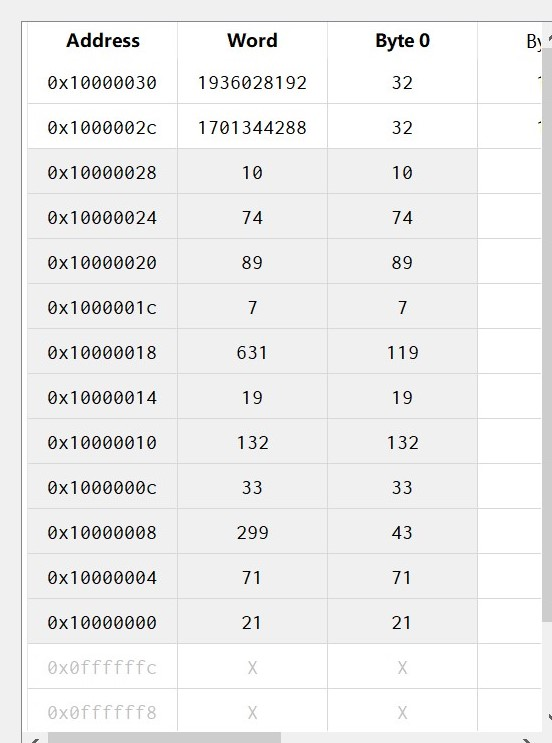
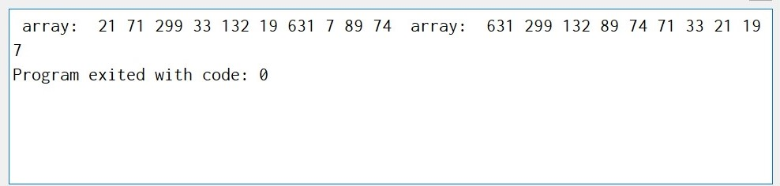
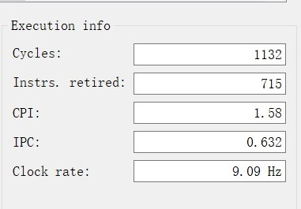

# **课内实验冒泡排序实验报告**

__林文浩 PB21050974__

**实现思路：**

首先在main代码段中加载存在数据段的十个整数和需要用到的字符串。接着跳转到bubble函数进行后面的操作。

在bubble函数中，首先进行压栈，将返回地址ra和十个整数存到栈中，并且双字对齐。接着往寄存器t1和t2各存放一个指针，t1指向即将与下一个整数发生比较交换的整数，t2指向最后一个还没换好位置的整数（最开始就是指向第十个整数，后来逐渐往前推）。

然后就开始调用swap进行比较交换，调用之前需要先把两个进行比较的数放在a0和a1中。每次比较交换结束之后，就会进行循环状态的判断。swap使用t0作为临时数据寄存器来进行交换。

首先，t1减8指向下一个整数，这时判断一下t1是否等于t2：

如果不等于，则跳转到compare，继续进行下一个数的swap。

如果等于，说明这一轮交换已经完成，当前t1指向的整数及其后面的所有整数都已经到达正确位置。此时需要将t1指回第一个整数，t2往前推一个整数。

这个时候再次进行判断，看看t1和t2是否相等：如果相等，说明所有数字都已经排序完成，跳转到complete完成函数的收尾工作（出栈和返回）；如果不相等，则跳转到compare，继续进行下一个数的swap；

返回main之后，再跳转到print进行最后的排序好的数据的打印。最后通过系统调用退出执行。

**解释核心部分汇编代码：**

```assembly
	#这段是冒泡中比较和交换的循环部分
	#如上所述，这里t1和t2是指针，分别指向即将交换的整数和最后一个未正确置位的整数
	addi t1, sp, 72 
	mv t2, sp 

	#这里将t1指向的整数及其它后面的另一个整数从内存加载到寄存器，进行比较交换，然后存回内存中
	compare:
	lw a0, 0(t1)
	lw a1, -8(t1)
	jal swap
	sw a0, 0(t1)
	sw a1, -8(t1)
	
	# 这下面判断如何进行分支
	addi t1, t1, -8 # t1指向下一个整数
	bne t1, t2, compare # 如果t1不等于t2,则继续重复以上的交换步骤，否则执行下面几行指令
	addi t1, sp, 72 # t1指回到第一个整数
	addi t2, t2, 8 # t2向前推进一个整数
	beq t1, t2, complete # 判断是否已经全部排序完成，如果是，跳转到排序结束
	jal compare
```

__展示内存数据段映像（截图）判断一下哪里是数据段__



__使用Ripes内系统调用在控制台打印排序前后的数组（截图）__



__出现的典型问题以及解决过程/方法__

1. 压栈时双字对齐减去8的倍数，出栈时却没有双字对齐，加上了四的倍数，导致取到错误的数据；解决方式，出入栈均采用双字对齐。
2. 进行交换时使用了重复的临时数据寄存器，导致有用的数据被覆盖；解决方式，改用别的寄存器存储临时变量。

 __完整代码__

``` assembly
.data
z0: .word 21
z1: .word 71
z2: .word 299
z3: .word 33
z4: .word 132
z5: .word 19
z6: .word 631
z7: .word 7
z8: .word 89
z9: .word 74
length: .word 10 # number of element 
str: .string " array: "
space: .string " "

.text
main:
    lw a0, z0
    lw a1, z1
    lw a2, z2
    lw a3, z3
	lw a4, z4
	lw a5, z5
	lw a6, z6
	lw a7, z7
	lw t0, z8
	lw t1, z9
	jal ra, bubble
	jal ra, print
	# Exit program
    li a7, 10
    ecall

bubble:
	#Place return address and the 10 input arguments on the stack
	addi sp, sp, -88
	sw ra, 80(sp)
	sw a0, 72(sp)
	sw a1, 64(sp)
	sw a2, 56(sp)
	sw a3, 48(sp)
	sw a4, 40(sp)
	sw a5, 32(sp)
	sw a6, 24(sp)
	sw a7, 16(sp)
	sw t0, 8(sp)
	sw t1, 0(sp)

	jal ra, print

	#initiate t1 and t2
	addi t1, sp, 72 # where the number should be swapped by next number(if less than)
	mv t2, sp # the last number of this cycle,if t1 == t2,reset t1 to the first number and do not swap

	compare: # if a0 < a1 ,swap them
	lw a0, 0(t1)
	lw a1, -8(t1)
	jal swap
	sw a0, 0(t1)
	sw a1, -8(t1)
	
	# update the cycle condition
	addi t1, t1, -8 # update t1
	bne t1, t2, compare # judge if t1 == t2
	addi t1, sp, 72 # reset t1
	addi t2, t2, 8 # update t2
	beq t1, t2, complete # judge if complete
	jal compare

	complete:
	lw ra, 80(sp)
	lw a0, 72(sp)
	lw a1, 64(sp)
	lw a2, 56(sp)
	lw a3, 48(sp)
	lw a4, 40(sp)
	lw a5, 32(sp)
	lw a6, 24(sp)
	lw a7, 16(sp)
	lw t0, 8(sp)
	lw t1, 0(sp)
	addi sp, sp, 88 # pop
	ret
swap:
	bge a0, a1, end
	mv t0, a0
	mv a0, a1
	mv a1, t0
	end:
	ret

print:
	mv t2, a0
	mv t3, a7
	# print str
	la a0, str
    li a7, 4
	ecall
	# print z0~z9
	li a7, 1
	mv a0, t2
	ecall
    li a7, 4
	la a0, space
	ecall

	li a7, 1
	mv a0, a1
	ecall
	li a7, 4
	la a0, space
	ecall

	li a7, 1
	mv a0, a2
	ecall
	li a7, 4
	la a0, space
	ecall

	li a7, 1
	mv a0, a3
	ecall
	li a7, 4
	la a0, space
	ecall

	li a7, 1
	mv a0, a4
	ecall
	li a7, 4
	la a0, space
	ecall

	li a7, 1
	mv a0, a5
	ecall
	li a7, 4
	la a0, space
	ecall

	li a7, 1
	mv a0, a6
	ecall
	li a7, 4
	la a0, space
	ecall

	li a7, 1
	mv a0, t3
	ecall
	li a7, 4
	la a0, space
	ecall

	li a7, 1
	mv a0, t0
	ecall
	li a7, 4
	la a0, space
	ecall

	li a7, 1
	mv a0, t1
	ecall
	li a7, 4
	la a0, space
	ecall

	ret
```

__测量程序执行时间__

选择时钟周期为100ms，测量得到运行需要125s，对于一个典型的时钟频率为40MHz的CPU，换算得到需要运行的时间约为$0.00003125s$。或者也可以从ripes中可以直接得到总共用的时钟周期如下图所示，$1132\times\frac{1}{40\times10^6}s=0.0000283s$


