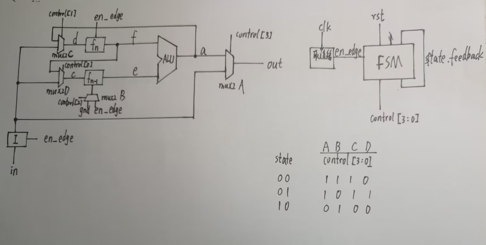

# Lab 1 Report

### 实验目的与内容

本次实验内容是使用verilog语言，运用模块化的方式设计并综合一个ALU电路，在设计的过程中合理运用vivado仿真功能对组合逻辑和时序逻辑电路进行检测，以及生成bit文件烧写到fpga开发板来验证电路的正确性。在此基础上利用算数逻辑单元组成一个可用于计算斐波那契数列的电路（FLS），并同样进行仿真和下载测试。

### 逻辑设计

##### FLS模块框图和数据通路


##### FLS模块框图和数据通路



##### FLS状态机的状态转移图


##### 核心设计代码

ALU实现方式，其中减法是通过加相反数（补码）来实现，这样子的话溢出判断也可以复用

```verilog
module alu #(parameter WIDTH = 7)
(
    input [3:0]func,
    input [WIDTH-1:0]a,
    input [WIDTH-1:0]b,
    output reg [WIDTH-1:0]y,
    output reg overflow
);
wire [WIDTH-1:0]c;//c为b的相反数
assign c = ~(b-1);
always @(*)
begin
    case(func)
        4'b0000://加法
        begin
        y = a + b;
        overflow = (a[WIDTH-1]) & (b[WIDTH-1]) & (~y[WIDTH-1]) | (~a[WIDTH-1]) & (~b[WIDTH-1]) & (y[WIDTH-1]);
        end
        4'b0001://减法
        begin
        y = a + c;//也可以是a - b
        overflow = (a[WIDTH-1]) & (c[WIDTH-1]) & (~y[WIDTH-1]) | (~a[WIDTH-1]) & (~c[WIDTH-1]) & (y[WIDTH-1]);
        end
        ...
        ...
        ...//不同功能的代码较为相似，省略一部分
        default:
        y = 0;
    endcase
end
endmodule
```


FLS莫尔型状态机模块，该模块承担控制状态转移和控制信号输出功能，其中输出的control[3:0]分别控制四个mux2选择器，以决定不同转态下数据的流通方向。

``` verilog
module state//
(
    input clk,rst,
    input [1:0]last_state,
    output reg[1:0]next_state,
    output reg[3:0]control
);
always @(posedge clk)
begin
    if(rst)
    begin
        next_state <= 2'b00;
        control <= 4'b1111;
    end
    else if(last_state == 00 )
    begin
        next_state <= 2'b01;
        control <= 4'b1011;
    end
    else if(last_state == 01 )
    begin
    next_state <= 2'b10;
    control <= 4'b0100;
    end
end
endmodule
```

由时钟信号和en信号生成信号边缘的模块，该模块能够生成长度为一个时钟的控制信号，使得一次按键的输入只会转移一次状态。

```verilog
module signal_edge
(
    input clk,
    input button,
    output button_edge
);
reg button_r1,button_r2;
always @(posedge clk)
button_r1 <= button;
always @(posedge clk)
button_r2 <= button_r1;
assign button_edge = button_r1 & (~button_r2);
endmodule
```

### 仿真结果与分析

对fls的总体仿真，这个仿真的关键是除了数列的递增功能正常外，还得测试复位是否正常，所以在结果拉高了rst，观察发现在en信号边缘上升沿处发生了同步复位，符合预期

```verilog
module simulation();
    reg clk,rst;
    reg [6:0]i;
    wire [6:0]o;
    reg en;
    fls fls(.clk(clk),.rst(rst),.i(i),.o(o),.en(en));

    always #5 clk = ~clk;

    initial 
    begin
        clk = 0;en = 0;
        rst = 1; i = 7'b0000001;#20
        en = 1;#30 en = 0;
        rst = 0; i = 7'b0000001;#20
        rst = 0; i = 7'b0000001;#20
        en = 1;#30 en = 0;
        rst = 0; i = 7'b0000001;#20 
        en = 1;#30 en = 0;
        rst = 0; i = 7'b0000001;#20
        en = 1;#30 en = 0;
        rst = 0; i = 7'b0000001;#20
        en = 1;#30 en = 0;
        rst = 0; i = 7'b0000001;#20
        rst = 0; i = 7'b0000001;#20 
        rst = 0; i = 7'b0000001;#20
        en = 1;#30 en = 0;
        rst = 1; i = 7'b0000001;#20
        en = 1;#30 en = 0;
        $finish;
    end
endmodule
```

结果如下


### 电路设计与分析

RTL分析电路


综合后电路


对比可发现：分析电路原理图只是生成了电路逻辑关系，但并没有生成fpga板上真正的排线关系。但是它们都是真正意义上的电路通路，都能够比行为仿真更好地模拟真实的电路。

### 测试结果与分析

将fls工程的bit文件烧入fpgaol中进行测试，通过en按键连续两次输入1，可以看到Led均输出1，在第三次操作开始，switch的输入已经不会影响运行结果，逐次点击button，可以发现数列按预期的斐波那契数列的规律递增。


### 总结

本实验中，我完整地体会了逻辑电路的完整设计与验证流程，对verilog背后描述的真实硬件有了更清晰的认识。我认为收获最大的是学会了通过仿真验证电路及修复bug，有了vivado几种仿真功能的辅助我可以较快地定位到错误从而及时修正。本次实验中也遇到了许多问题，比如在实例化模块时未对某个输入进行赋值，导致仿真过程中该线路上的信号一直是高阻态；另外，使用always进行赋值时也经常忘记定义变量为reg类型，这也导致了许多不必要的报错。
