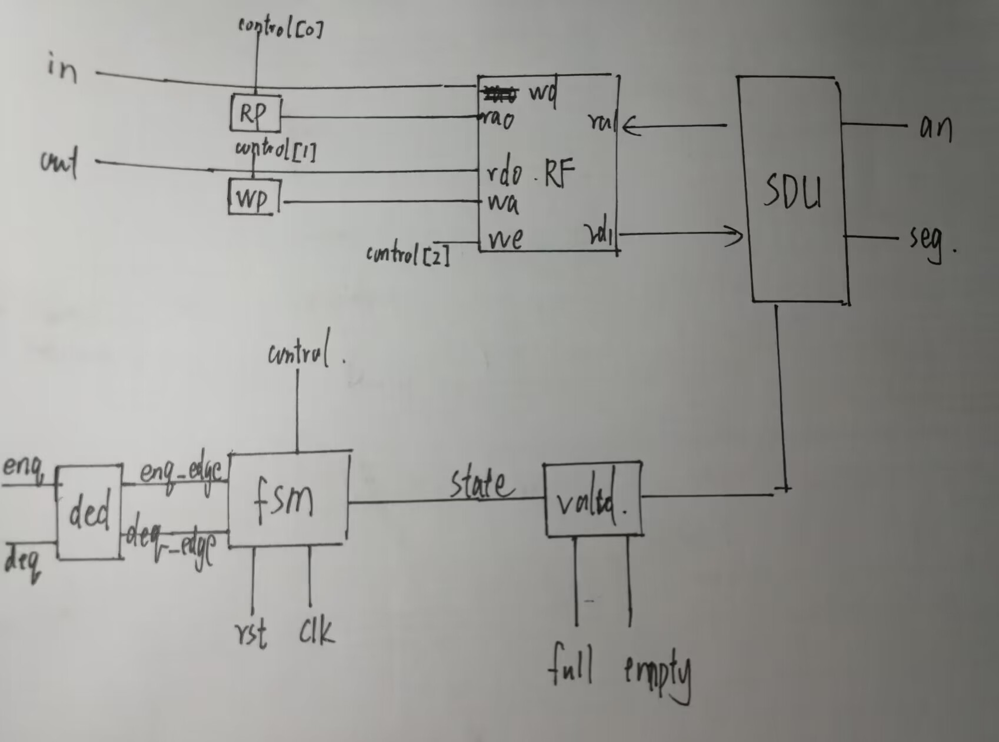
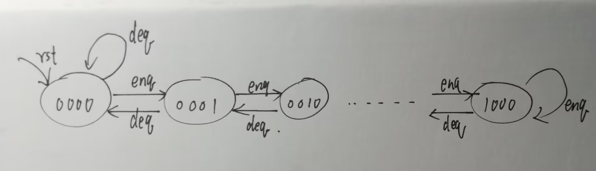
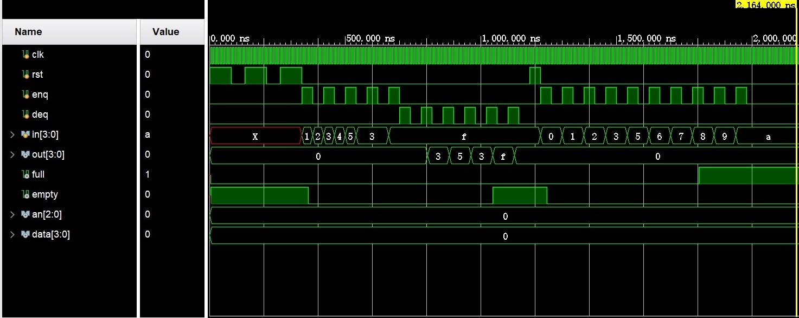
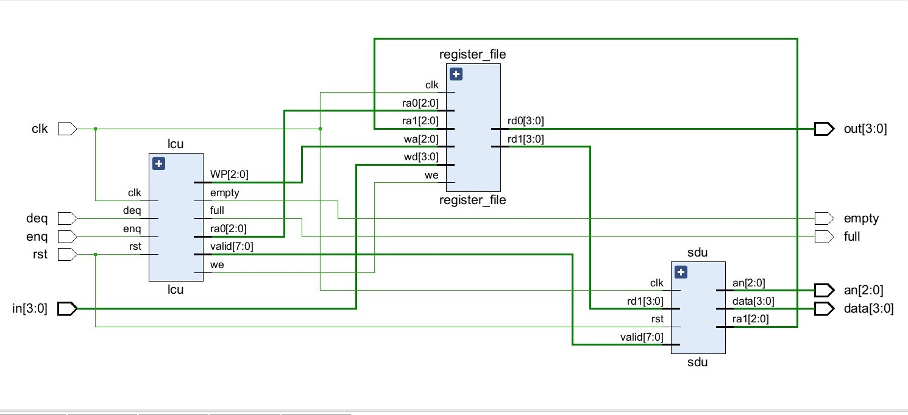
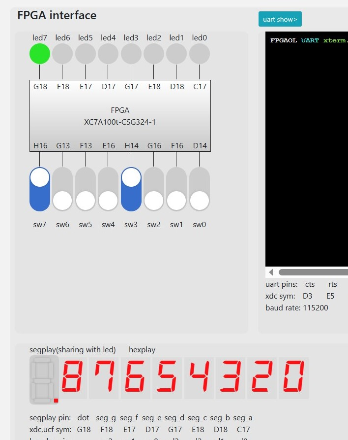

# Lab 2 Report

__林文浩 PB21050974__

### 实验目的与内容

 学习寄存器堆（Register File）功能、时序及其应用，并在该基础上利用寄存器堆实现FIFO队列。学习如何使用IP核例化不同类型的存储器，并在仿真中研究不同存储器的性质差异。

### 逻辑设计

##### FIFO模块框图和数据通路



__状态转移图__



##### 核心设计代码

寄存器堆设计代码,重点在于对x0的修改是无效的

```verilog
module register_file    //三端口8 x 4寄存器堆
#(parameter WIDTH = 4) //数据宽度和存储器深度
( 
    input clk,                  //时钟（上升沿有效）
    input [2:0] ra0,           //读端口0地址
    output reg [WIDTH-1:0] rd0,  //读端口0数据
    input [2:0] ra1,            //读端口1地址
    output reg [WIDTH-1:0] rd1,  //读端口1数据
    input [2:0] wa,            //写端口地址
    input we,                   //写使能，高电平有效
    input [WIDTH-1:0] wd     //写端口数据
);
    reg [WIDTH-1:0] regfile[0 : 7];//注意这个是数组
    always @(*)
    begin
        if(ra0 != 0)
        rd0 <= regfile[ra0];
        else
        rd0 <= 0;
        if(ra1 != 0)
        rd1 <= regfile[ra1];
        else
        rd1 <= 0;
    end
    always @ (posedge clk) 
    begin
    regfile[0] <= 0;
        if (we && (wa != 0))//只有当地址不为0时，才能对寄存器进行改写
    regfile[wa] <= wd;
    end
endmodule
```

FIFO顶层代码,仅实例化了lcu、reg_file和sdu，更加细化的操作应当在各模块内完成，其中in和out直接连到寄存器堆的wd和rd0端口，可以不需要经过lcu

```verilog
module fifo
(
    input clk,rst,
    input enq,deq,
    input [3:0] in,
    output [3:0] out,
    output full,empty,
    output [2:0] an,
    output [3:0] data
);
wire [2:0] ra1;
wire [3:0] rd1;
wire [2:0] RP,WP,ra0;
wire we;
wire [7:0] valid;

lcu lcu(.clk(clk),.rst(rst),.enq(enq),.deq(deq),.full(full),.empty(empty),.RP(RP),.WP(WP),.we(we),.valid(valid),.ra0(ra0));
register_file register_file(.clk(clk),.ra0(ra0),.wa(WP),.rd0(out),.wd(in),.we(we),.rd1(rd1),.ra1(ra1));
sdu sdu(.clk(clk),.rst(rst),.valid(valid),.rd1(rd1),.ra1(ra1),.an(an),.data(data));
endmodule
```

莫尔型有限状态机，期望的效果是状态只受输入的enq和deq影响,控制信号由state产生，相当于fsm只输出控制信号

```verilog
module fsm
(
    input clk,rst,
    input enq_edge,deq_edge,
    output reg [3:0] state
);
always @(posedge clk)
begin
    if(rst)
    state <= 4'b0000;
    else if(enq_edge & (state != 4'b1000))
    state <= state + 1;
    else if(deq_edge & (state != 4'b0000))
    state <= state - 1;
end
endmodule
```

约束文件

```verilog
set_property -dict {PACKAGE_PIN E3  IOSTANDARD LVCMOS33} [get_ports { clk }];
set_property -dict {PACKAGE_PIN B18 IOSTANDARD LVCMOS33} [get_ports { rst }];
#switchs
set_property -dict {PACKAGE_PIN H16 IOSTANDARD LVCMOS33} [get_ports { enq }];
set_property -dict {PACKAGE_PIN G13 IOSTANDARD LVCMOS33} [get_ports { deq }];
#set_property -dict {PACKAGE_PIN F13 IOSTANDARD LVCMOS33} [get_ports {  }];
#set_property -dict {PACKAGE_PIN E16 IOSTANDARD LVCMOS33} [get_ports {  }];
set_property -dict {PACKAGE_PIN H14 IOSTANDARD LVCMOS33} [get_ports { in[3] }];
set_property -dict {PACKAGE_PIN G16 IOSTANDARD LVCMOS33} [get_ports { in[2] }];
set_property -dict {PACKAGE_PIN F16 IOSTANDARD LVCMOS33} [get_ports { in[1] }];
set_property -dict {PACKAGE_PIN D14 IOSTANDARD LVCMOS33} [get_ports { in[0] }];

#leds
set_property -dict {PACKAGE_PIN G18 IOSTANDARD LVCMOS33} [get_ports { full }];
set_property -dict {PACKAGE_PIN F18 IOSTANDARD LVCMOS33} [get_ports { empty }];
#set_property -dict {PACKAGE_PIN E17 IOSTANDARD LVCMOS33} [get_ports {  }];
#set_property -dict {PACKAGE_PIN D17 IOSTANDARD LVCMOS33} [get_ports {  }];
set_property -dict {PACKAGE_PIN G17 IOSTANDARD LVCMOS33} [get_ports { out[3] }];
set_property -dict {PACKAGE_PIN E18 IOSTANDARD LVCMOS33} [get_ports { out[2] }];
set_property -dict {PACKAGE_PIN D18 IOSTANDARD LVCMOS33} [get_ports { out[1] }];
set_property -dict {PACKAGE_PIN C17 IOSTANDARD LVCMOS33} [get_ports { out[0] }];
#hexplay
set_property -dict { PACKAGE_PIN A14   IOSTANDARD LVCMOS33 } [get_ports { data[0] }];
set_property -dict { PACKAGE_PIN A13   IOSTANDARD LVCMOS33 } [get_ports { data[1] }];
set_property -dict { PACKAGE_PIN A16   IOSTANDARD LVCMOS33 } [get_ports { data[2] }];
set_property -dict { PACKAGE_PIN A15   IOSTANDARD LVCMOS33 } [get_ports { data[3] }];
set_property -dict { PACKAGE_PIN B17   IOSTANDARD LVCMOS33 } [get_ports { an[0] }];
set_property -dict { PACKAGE_PIN B16   IOSTANDARD LVCMOS33 } [get_ports { an[1] }];
set_property -dict { PACKAGE_PIN A18   IOSTANDARD LVCMOS33 } [get_ports { an[2] }];
```

### 仿真结果与分析

仿真测试代码

```verilog
`timescale 1ns / 1ps

module simulation();//fifo测试
reg clk,rst;
reg enq,deq;
reg [3:0]in;
wire [3:0]out;
wire full,empty;
wire [2:0]an;
wire [3:0] data;
fifo fifo(.deq(deq),.enq(enq),.in(in),.out(out),.clk(clk),.rst(rst),.empty(empty),.full(full),.an(an),.data(data));

always #5 clk = ~clk;

initial 
begin
    clk = 0;enq = 0;deq = 0;
    rst = 1;#80 rst = 0;#50
    rst = 1;#80 rst = 0;#50
    rst = 1;#80 rst = 0;
    enq = 1;in = 4'b0001;#40
    enq = 0;in = 4'b0010;#40
    enq = 1;in = 4'b0011;#40
    enq = 0;in = 4'b0100;#40
    enq = 1;in = 4'b0101;#40
    enq = 0;in = 4'b0011;#40
    enq = 1;in = 4'b0011;#40
    enq = 0;in = 4'b0011;#40
    enq = 1;in = 4'b1111;#40
    enq = 0;

    deq = 1;#40 
    deq = 0;#40
    deq = 1;#40 
    deq = 0;#40
    deq = 1;#40 
    deq = 0;#40
    deq = 1;#40 
    deq = 0;#40
    deq = 1;#40 
    deq = 0;#40
    deq = 1;#40 
    deq = 0;#40

    rst = 1;#40 rst = 0;
    
    enq = 1;in = 4'h0;#40
    enq = 0;#40
    enq = 1;in = 4'h1;#40
    enq = 0;#40
    enq = 1;in = 4'h2;#40
    enq = 0;#40
    enq = 1;in = 4'h3;#40
    enq = 0;#40
    //deq = 1;in = 4'h4;#40//
    //deq = 0;#40
    enq = 1;in = 4'h5;#40
    enq = 0;#40
    enq = 1;in = 4'h6;#40
    enq = 0;#40
    enq = 1;in = 4'h7;#40
    enq = 0;#40
    enq = 1;in = 4'h8;#40
    enq = 0;#40
    enq = 1;in = 4'h9;#40
    enq = 0;#40
    enq = 1;in = 4'ha;#40
    enq = 0;
    #500
    $finish;
end
endmodule
```

仿真结果如下



本实验仿真的思路是需要测试入队列和出队列是否正常，并尝试模拟各种极端情况，比如队列满，队列中途空，队列满时指针不在0处等情况。事实证明，严谨的仿真会带来上板测试的方便，能够在生成bit文件前快速定位到缺陷。

### 电路设计与分析

RTL分析电路




分析RTL电路可看出，实际生成电路图与设计基本符合


### 测试结果与分析



经测试上板结果能够顺利完成出/入队列，输出full、empty信号和复位等功能。

### 总结

本次实验遇到许多问题，最后都通过debug解决了，在这里记录以下两个主要问题：

1. 给数码管的软件时钟频率比较低或比较高的时候都会造成显示不正常，导致以为是程序有其他bug，实际上只是刷新率的问题。
2. 定义了wire [7:0] valid，当valid == 8'b11111111时，valid + 1 会等于0，这是平时经常用的；在这次实验中，我想获取valid的某一位，比如valid[i],可正常获得，但是，当我用valid[i+1]时，却会出错，原因在于valid[7+1]并不会等于valid[0],即括号内数字不会循环，只能加一个判断是否i=7,如果是，手动置为valid[0].
