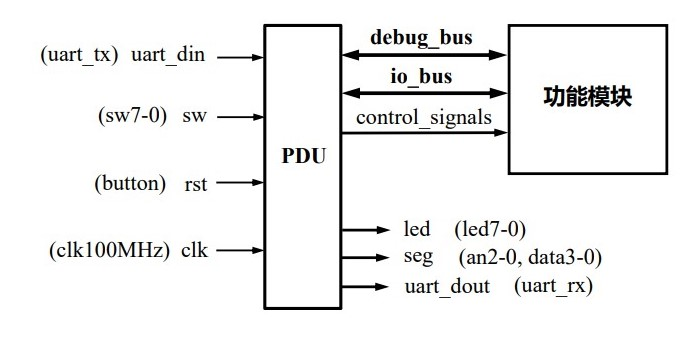
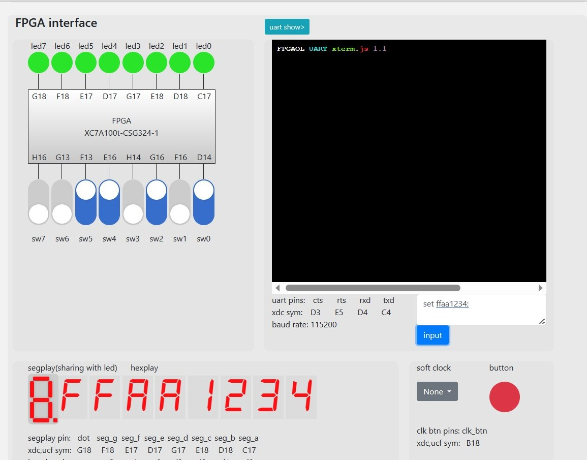
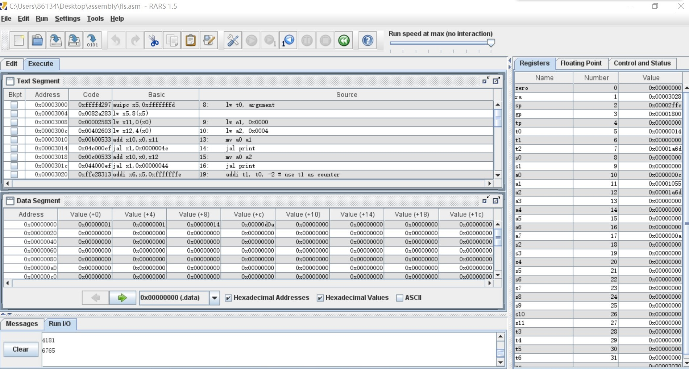
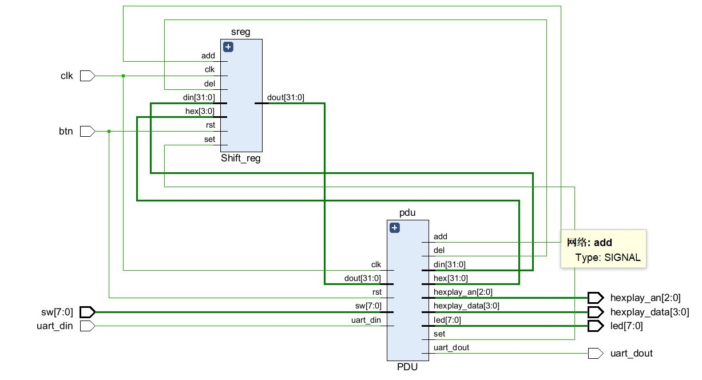

# Lab 3 Report

__林文浩 PB21050974__

### 实验目的与内容

 设计32位移位寄存器，学会使用PDU模块进行模块的测试；写一个riscv汇编程序，用于计算斐波那契数列的前n项，从中了解汇编程序的基本写法。

### 逻辑设计




### 核心设计代码

移位寄存器：

该移位寄存器实现代码较为简单，但是需要注意的一点是左移的情况中，如果采用dout <= (dout << 4) + hex的方式则会生成一个运算器，电路变得复杂，而使用位拼接的方式代替则能大大提高电路的简洁程度，也降低了逻辑电路的延迟。

```verilog
module Shift_reg(
    input rst,
    input clk,          // Work at 100MHz clock

    input [31:0] din,   // Data input  
    input [3:0] hex,    // Hexadecimal code for the switches
    input add,          // Add signal
    input del,          // Delete signal
    input set,          // Set signal
    
    output reg [31:0] dout  // Data output
);

    always @(posedge clk)
    begin
        if(rst)
        dout <= 0;
        else if(add)
        dout <= {dout[27:0],hex[3:0]};
        //dout <= (dout << 4) + hex;//用位拼接更好
        else if(del)
        dout <= dout >> 4;
        else if(set)
        dout <= din;
    end
endmodule
```

rars斐波那契数列计算汇编代码：

该部分的核心部分主要在fls：cycle：里，该汇编程序通过一个计数器（存在t1里）来判断循环次数是否已经到达所设置的数字，如果到达则跳出循环（即不跳转回fls重复执行）。需要注意的是，在fls函数里跳转到其他函数之前（比如print），需要将ra里的值即返回地址保存在内存里，因为再次调用jal时会用新值覆盖ra，如果不保存的话则fls执行结束后将无法回到主函数中。此处我将ra保持在栈中。

```assembly
.data
1   #a1 in 0x0000   here a1 refer to the sequence,not the register
1   #a2 in 0x0004
argument: .word   20
str1:     .string "\n\r"
.text
main:
    lw t0, argument
    lw a1, 0x0000
    lw a2, 0x0004

    # print a1 and a2
    mv a0 a1
    jal print
    mv a0 a2
    jal print

    # calculate the following number
    addi t1, t0, -2 # use t1 as counter
    jal ra, fls

    # exit
    li a7, 10
    ecall


fls:
    # save return address
    addi sp, sp, -8
	sw ra, 0(sp)

    #cycle
    Cycle:
    add t2, a1, a2 # get the new valve in t2
    mv a1, a2
    mv a2, t2
    mv a0, t2
    jal print
    addi t1, t1, -1
    bne t1, zero, Cycle

    # finish
    lw ra, 0(sp)
    addi sp, sp, 8
    ret

print:
    li a7, 1
    ecall
    li a7, 4
    la a0, str1
    ecall
    ret

```

### 测试结果与分析



将移位寄存器结合PDU模块的电路生成的bit文件烧写后测试，左右移位功能均正常，并可以正确使用串口进行数码管显示的设置



运行可以发现利用系统调用输出的斐波那契数列符合正确值，单步运行，可以看到计数器（t1）逐渐减少，直到减到0时循环停止。

### 电路设计与分析



查看RTL电路分析图，可以看出PDU与需要测试的移位寄存器之间的数据通路符合预期设计。

### 总结

本实验中学会了如何使用PDU进行模块的调试，相较于仿真调试，通过PDU可以对真实的电路进行调试。在编写汇编程序的时候，也对和内存cpu中的寄存器有了更深的理解。
