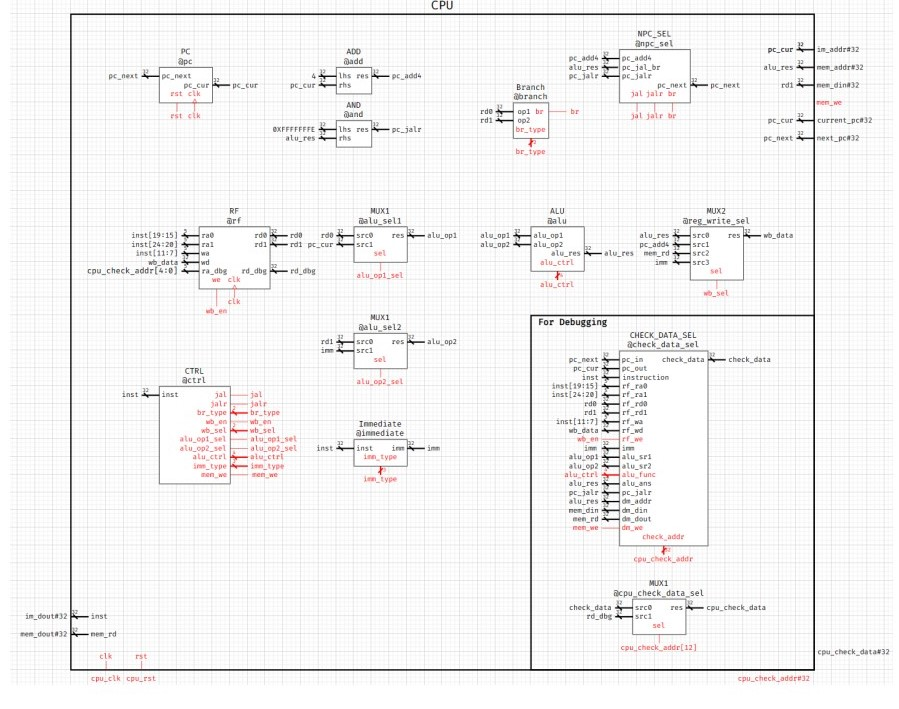
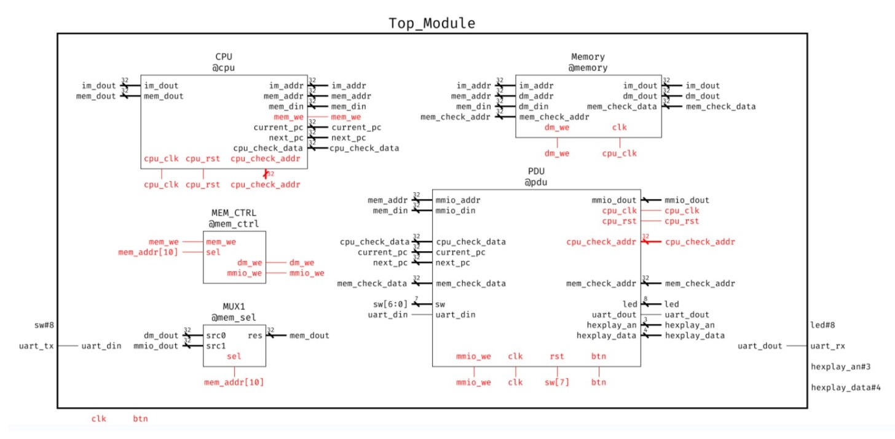
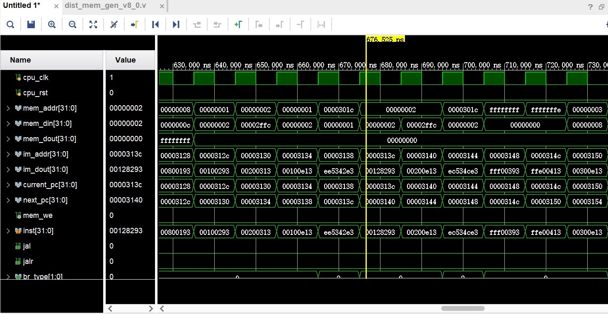
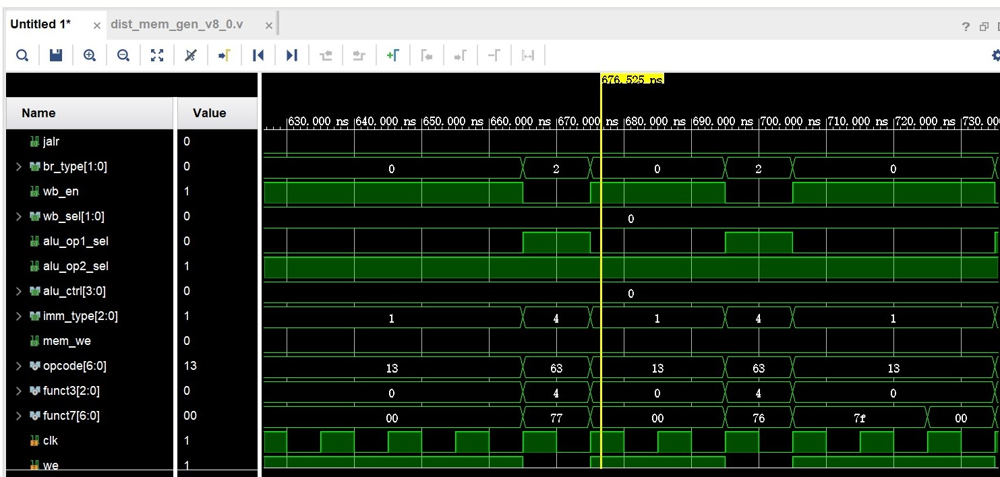
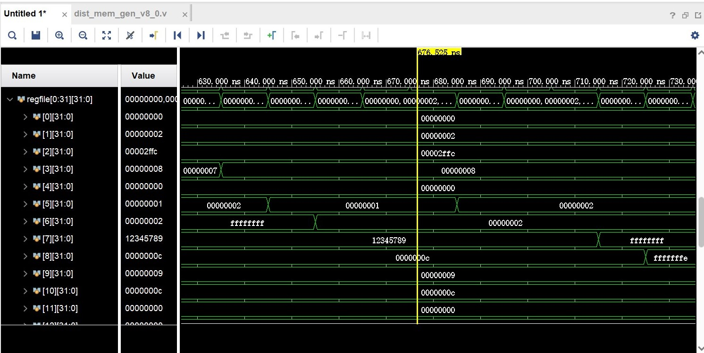
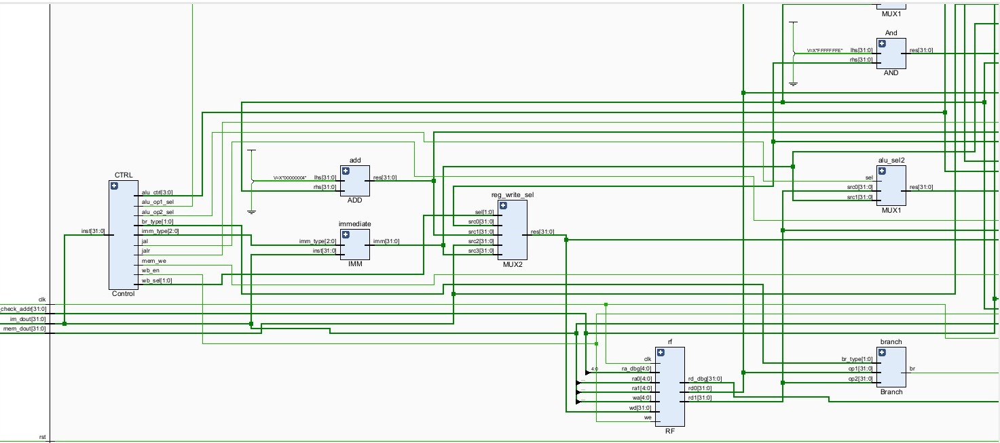
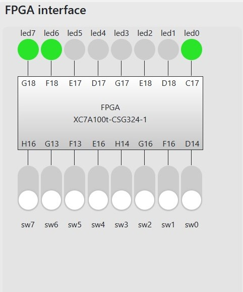

# Lab 4 Report

__林文浩 PB21050974__

### 实验目的与内容

 理解单周期CPU的结构和工作原理并在此基础上熟练掌握单周期CPU数据通路和控制器的设计和描述方法，在这个过程中掌握调试的方法。

### 逻辑设计






采用模块化的设计，将CPU内的各个模块分别独立设计，再将其按照功能逻辑连接成完整的CPU，并连接PDU模块以便对其进行调试。

### 核心设计代码

控制器：

负责译码，将指令解读并转化为控制信号

```verilog
module Control
(
    input [31:0] inst,
    output reg jal,jalr,
    output reg [1:0] br_type,
    output reg wb_en,       //00: alu_res    01: pc_add4  10: mem_rd   11: imm  写回来源
    output reg [1:0] wb_sel,
    output reg alu_op1_sel, //0: rd0    1: pc_cur
    output reg alu_op2_sel, //0: rd1    1: imm
    output reg [3:0] alu_ctrl,
    output reg [2:0] imm_type,//000: 无效 
    output reg mem_we
);

wire [6:0] opcode;
wire [2:0] funct3;
wire [6:0] funct7;
assign opcode = inst[6:0];
assign funct3 = inst[14:12];
assign funct7 = inst[31:25];

always @(*)
begin
    if(opcode == 7'b0110011 && funct3 == 3'b000 && funct7 == 7'b0000000)//1.add
    begin
        jal = 0;
        jalr = 0;
        br_type = 2'b00;
        wb_en = 1;
        wb_sel = 2'b00;//alu_res写回
        alu_op1_sel = 0;
        alu_op2_sel = 0;
        alu_ctrl = 4'b0000;
        imm_type = 3'b000;
        mem_we = 0;
    end
    else if(opcode == 7'b0010011 && funct3 == 3'b000)//2.addi
    begin
        jal = 0;
        jalr = 0;
        br_type = 2'b00;
        wb_en = 1;
        wb_sel = 2'b00;//alu_res写回
        alu_op1_sel = 0;
        alu_op2_sel = 1;//imm
        alu_ctrl = 4'b0000;
        imm_type = 3'b001;
        mem_we = 0;
    end
    else if(opcode == 7'b0110111)//3.lui
    begin
        jal = 0;
        jalr = 0;
        br_type = 2'b00;
        wb_en = 1;
        wb_sel = 2'b11;//imm写回
        alu_op1_sel = 0;//不需要用到alu
        alu_op2_sel = 0;
        alu_ctrl = 4'b0000;
        imm_type = 3'b010;
        mem_we = 0;
    end
    else if(opcode == 7'b0010111)//4.auipc
    begin
        jal = 0;
        jalr = 0;
        br_type = 2'b00;
        wb_en = 1;
        wb_sel = 2'b00;//alu写回
        alu_op1_sel = 1;//pc_cur
        alu_op2_sel = 1;//imm
        alu_ctrl = 4'b0000;
        imm_type = 3'b010;
        mem_we = 0;
    end
    else if(opcode == 7'b1101111)//5.jal
    begin
        jal = 1;
        jalr = 0;
        br_type = 2'b00;
        wb_en = 1;
        wb_sel = 2'b01;//pc_add4写回寄存器
        alu_op1_sel = 1;//pc_cur,alu计算结果写入pc而不是寄存器
        alu_op2_sel = 1;//imm
        alu_ctrl = 4'b0000;//这里不需要送到AND清除最低位是因为pc_cur和imm已经保证是偶数了
        imm_type = 3'b011;
        mem_we = 0;
    end
    else if(opcode == 7'b1100111 && funct3 == 3'b000)//6.jalr
    begin
        jal = 0;
        jalr = 1;
        br_type = 2'b00;
        wb_en = 1;
        wb_sel = 2'b01;//pc_add4写回寄存器
        alu_op1_sel = 0;//rd0,alu计算结果写入pc而不是寄存器
        alu_op2_sel = 1;//imm
        alu_ctrl = 4'b0000;//add计算的结果会送到AND进行最后一位的抹零
        imm_type = 3'b001;
        mem_we = 0;
    end
    else if(opcode == 7'b1100011 && funct3 == 3'b000)//7.beq
    begin
        jal = 0;
        jalr = 0;
        br_type = 2'b01;
        wb_en = 0;
        wb_sel = 2'b00;
        alu_op1_sel = 1;//pc_cur,,alu计算结果写入pc而不是寄存器
        alu_op2_sel = 1;//imm
        alu_ctrl = 4'b0000;
        imm_type = 3'b100;
        mem_we = 0;
    end
    else if(opcode == 7'b1100011 && funct3 == 3'b100)//8.blt
    begin
        jal = 0;
        jalr = 0;
        br_type = 2'b10;
        wb_en = 0;
        wb_sel = 2'b00;
        alu_op1_sel = 1;//pc_cur,,alu计算结果写入pc而不是寄存器
        alu_op2_sel = 1;//imm
        alu_ctrl = 4'b0000;
        imm_type = 3'b100;
        mem_we = 0;
    end
    else if(opcode == 7'b0000011 && funct3 == 3'b010)//9.lw
    begin
        jal = 0;
        jalr = 0;
        br_type = 2'b00;
        wb_en = 1;
        wb_sel = 2'b10;//从mem写回
        alu_op1_sel = 0;//rd0,alu计算结果用于mem_addr
        alu_op2_sel = 1;//imm
        alu_ctrl = 4'b0000;
        imm_type = 3'b001;
        mem_we = 0;
    end
    else if(opcode == 7'b0100011 && funct3 == 3'b010)//10.sw
    begin
        jal = 0;
        jalr = 0;
        br_type = 2'b00;
        wb_en = 0;
        wb_sel = 2'b00;
        alu_op1_sel = 0;//rd0,alu计算结果用于mem_addr
        alu_op2_sel = 1;//imm
        alu_ctrl = 4'b0000;
        imm_type = 3'b101;
        mem_we = 1;
    end
    else//缺省
    begin
        jal = 0;
        jalr = 0;
        br_type = 2'b00;
        wb_en = 0;
        wb_sel = 2'b00;
        alu_op1_sel = 0;
        alu_op2_sel = 0;
        alu_ctrl = 4'b0000;
        imm_type = 3'b000;
        mem_we = 0;
    end
end
endmodule
```

立即数生成单元：

该部分根据控制器传来的控制信号，判断如何由指令生成所需类型的立即数并将立即数送出。

```verilog
module IMM
(
    input [31:0] inst,
    input [2:0] imm_type,
    output reg [31:0] imm
);

always @(*)
begin
    if(imm_type == 3'b000)
    imm = 32'h00000000;
    else if(imm_type == 3'b001)//addi、jalr、lw
    imm = { {20{inst[31]}} , inst[31:20] };//12位符号扩展为32位
    else if(imm_type == 3'b010)//lui、auipc
    imm = { inst[31:12] , {12{1'b0}} };//20位后补12个0得到32位
    else if(imm_type == 3'b011)//jal
    imm = { {11{inst[31]}} , inst[31] , inst[19:12] , inst[20] , inst[30:21] , 1'b0 };//注意末尾是0,无法跳转到奇数地址
    else if(imm_type == 3'b100)//beq、blt
    imm = { {19{inst[31]}} , inst[31] , inst[7] , inst[30:25] , inst[11:8] , 1'b0 };//末尾是0
    else if(imm_type == 3'b101)//sw
    imm = { {20{inst[31]}} , inst[31:25] , inst[11:7] };
    else
    imm = 32'h00000000;//缺省
end
endmodule
```

分支模块：

负责根据分支指令的类型判断是否需要跳转

```verilog
module Branch
(
    input [31:0] op1,
    input [31:0] op2,
    input [1:0] br_type,//00:默认无效   01:beq  10:blt
    output reg br
);

always @(*)
begin
    if(br_type == 2'b01)
    br = (op1 == op2);
    else if(br_type == 2'b10)
    br = ($signed(op1)<$signed(op2));
    else
    br = 0;
end
endmodule
```

NPC_SEL:

负责决定下一条指令的来源

~~~verilog
module NPC_SEL
(
    input [31:0] pc_add4,
    input [31:0] pc_jal_br,
    input [31:0] pc_jalr,
    input jal,jalr,br,
    output reg [31:0] pc_next
);
always @(*)
begin
    if(jal == 1)
    pc_next = pc_jal_br;
    else if(jalr == 1)
    pc_next = pc_jalr;
    else if(br == 1)
    pc_next = pc_jal_br;
    else
    pc_next = pc_add4;//保证了初始inst为0时能正常跳转pc+4进入第一条指令
end

endmodule
~~~

PC:

~~~verilog
module PC
(
    input rst,clk,
    input [31:0] pc_next,
    output reg [31:0] pc_cur
);
always @(posedge clk,posedge rst)
begin
    if(rst)
    pc_cur <= 32'h00002ffc;
    else
    pc_cur <= pc_next;
end
endmodule

~~~

### 仿真结果与分析

使用了助教提供的测试专用汇编代码进行测试，经多次仿真测试并修改后得到了正确的仿真结果。

这里不止是查看了顶层模块的信号，而且将控制信号和寄存器堆的值全部添加到波形图中，通过观察控制信号和寄存器值的变化可以快速定位到存在的问题并修正。由于仿真图太大，这里没有全部给出，只给出了一个示例段。








### 电路设计与分析




查看RTL电路分析图，可以看出CPU的内部连线与设计时的数据通路符合，且未发现锁存器。

### 测试结果与分析



到fpgaol中测试成功

### 总结

像CPU这样负责的元件设计时要善于用模块化分解的思想，将不同功能的模块解耦，这样子就能单独测试各个模块的功能，使得修正错误的过程大大简化。另外在仿真测试时应注意观察控制信号，往往能从中得出一些有用的信息。

本次实验使得我对CPU的构造更加有了清晰明确的认识，在设计模块的过程中需要考虑到许多CPU运行中可能会遇到的问题。同时，我也发现了一个相同功能的CPU其实有许多不同的设计能将其实现，至于选择哪种，就要考虑这种结构是否看起来简明复杂度低且能够完成所有所需的功能。
