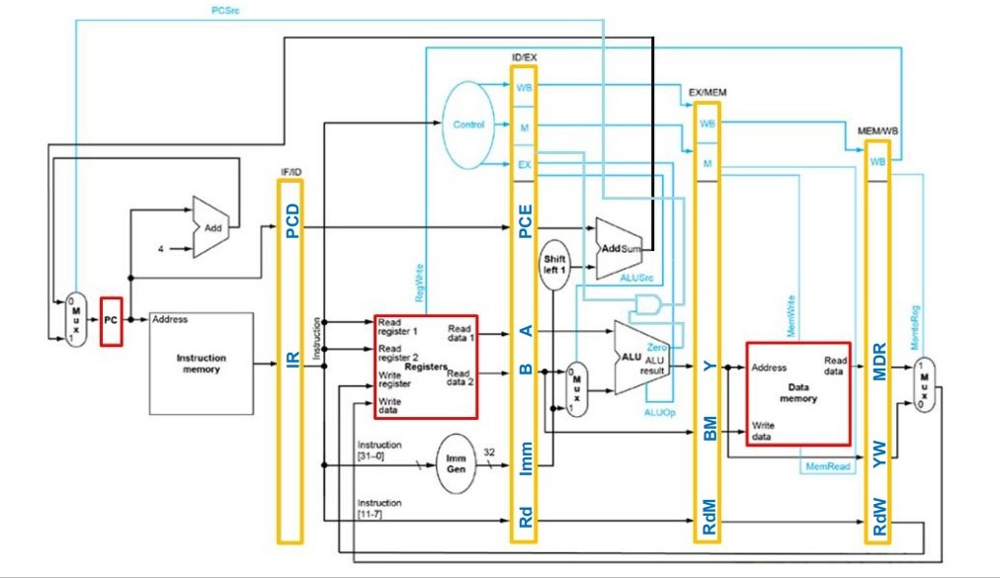
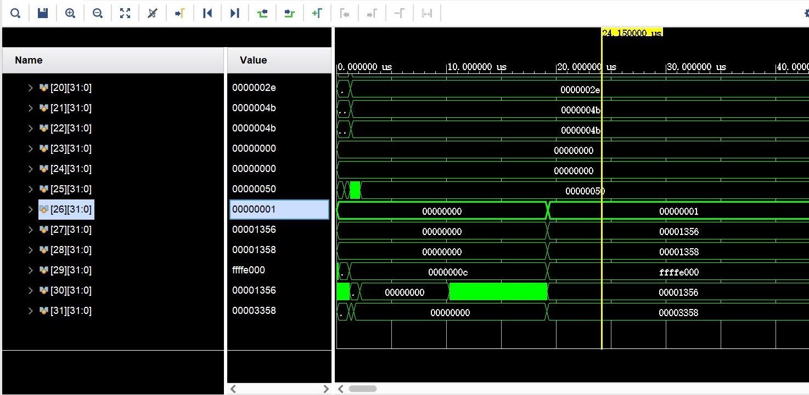
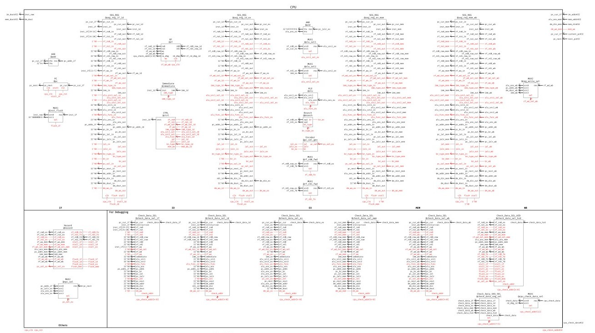
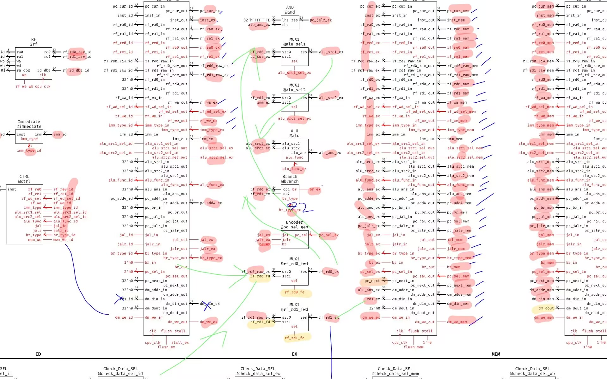
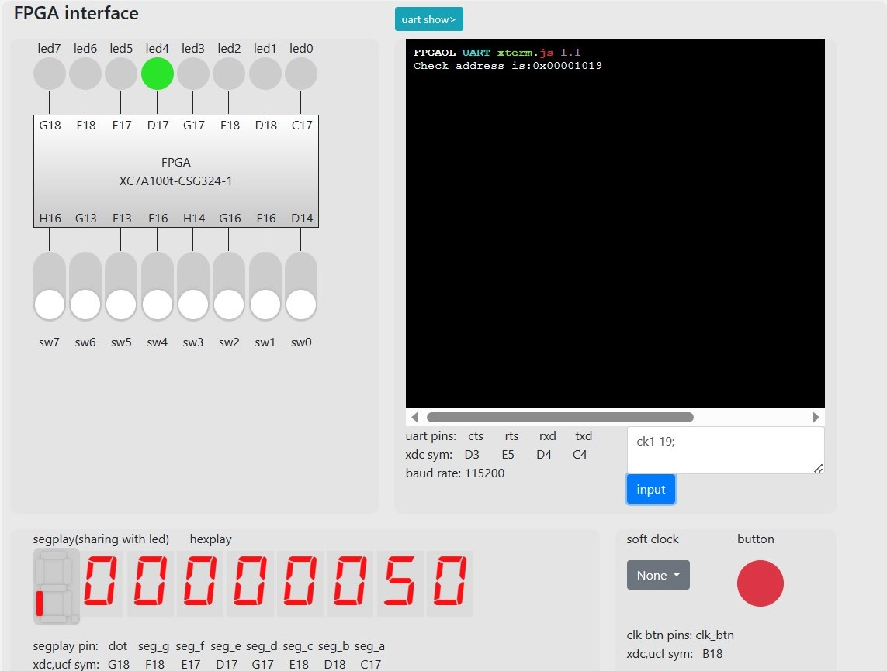
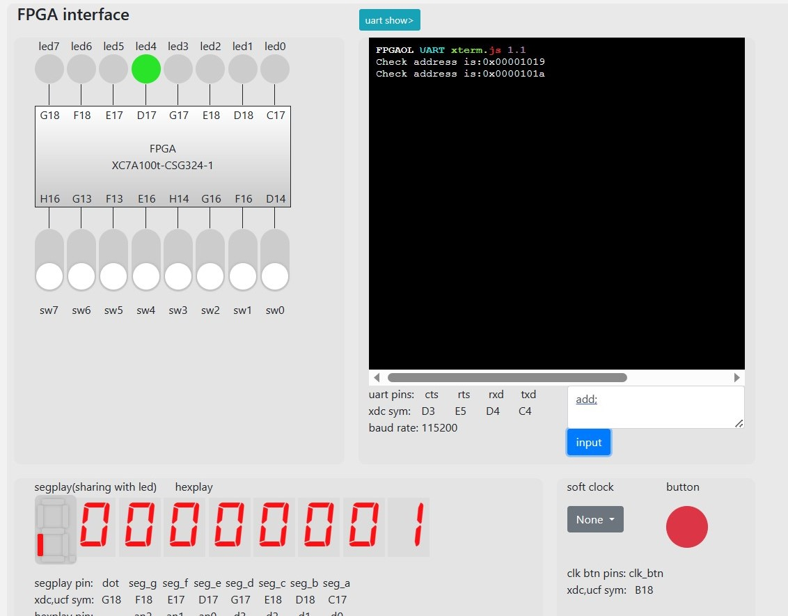

# Lab 5 Report

__林文浩 PB21050974__

### 实验目的与内容

理解流水线CPU的结构和工作原理

掌握流水线CPU的设计和调试方法，特别是流水线中数据相关和控制相关的处理

### 逻辑设计

在单周期CPU的基础上，将不同执行阶段的模块按照五段流水线的方式分开为五大区域，每个区域内的模块分别连接该阶段的控制信号线和数据信号线，不同区域之间的信号线被段间寄存器隔开，里面的信号分别属于不同条指令，由段间寄存器在时钟上升沿传送至下一区域；对于没有特别属于某一个阶段的模块采取单独划定区域的措施，比如hazard。

### 核心设计代码

hazard

本次实验最核心的模块，负责检测流水线中的冲突并给出相应控制信号来完成前递、清除、停顿等操作。

首先判断rd0和rd1是否满足前递的条件，并给出前递的类型，以供后续使用。然后将load后use单独归为一种情况，先判断是不是load后use，如果是，则stall，无论是否为跳转指令。然后如果不是load后use的情况，则对rd0和rd1根据情况进行前递，接着又分为两种情况，如果是跳转指令，则清空前部分的流水线，如果不是，则无需清空，根据这两种情况再给出相应的控制信号。（注意，即使是跳转指令也同样需要进行前递操作）

~~~verilog
//由于太长，省略了模块的声明部分
reg [1:0] Forward0;//00：rd0不用前递   01：由mem前递（上一条指令） 10：由wb前递（上上条指令）
reg [1:0] Forward1;
always @(*)
begin
    /*判断前递情况*/ /*注意，即使是跳转也要前递，因为计算跳转地址可能用到了alu的结果*/
    /*前一条指令有写回操作 && 写回寄存器不为x0 && rd0需要用到 && 写回寄存器恰好为读出寄存器*/
    if((rf_we_mem == 1) && (rf_wa_mem != 0) && (rf_re0_ex == 1) && (rf_ra0_ex == rf_wa_mem))
    Forward0 = 2'b01;
    else if((rf_we_wb == 1) && (rf_wa_wb != 0) && (rf_re0_ex == 1) && (rf_ra0_ex == rf_wa_wb))
    Forward0 = 2'b10;
    else
    Forward0 = 2'b00;

    if((rf_we_mem == 1) && (rf_wa_mem != 0) && (rf_re1_ex == 1) && (rf_ra1_ex == rf_wa_mem))
    Forward1 = 2'b01;
    else if((rf_we_wb == 1) && (rf_wa_wb != 0) && (rf_re1_ex == 1) && (rf_ra1_ex == rf_wa_wb))
    Forward1 = 2'b10;
    else
    Forward1 = 2'b00;

    if((Forward0 == 2'b01 || Forward1 == 2'b01) && rf_wd_sel_mem == 2'b10)//load后use，需要停顿（即使是跳转时use）
    begin
        stall_if = 1;
        stall_id = 1;
        stall_ex = 1;
        flush_if = 0;
        flush_id = 0;
        flush_ex = 0;
        flush_mem = 1;
        rf_rd0_fe = 0;
        rf_rd1_fe = 0;
        rf_rd0_fd = 0;
        rf_rd1_fd = 0;
    end
    else//无需停顿
    begin
        /*处理rd0前递*/
        if(Forward0 == 2'b01)
        begin
            rf_rd0_fe = 1;
            case (rf_wd_sel_mem)
                2'b00: rf_rd0_fd = alu_ans_mem;
                2'b01: rf_rd0_fd = pc_add4_mem;
                2'b11: rf_rd0_fd = imm_mem;
                default: rf_rd0_fd = 0;
            endcase
        end
        else if(Forward0 == 2'b10)
        begin
            rf_rd0_fe = 1;
            rf_rd0_fd = rf_wd_wb;
        end
        else
        begin
            rf_rd0_fe = 0;
            rf_rd0_fd = 0;
        end
        /*处理rd1前递*/
        if(Forward1 == 2'b01)
        begin
            rf_rd1_fe = 1;
            case (rf_wd_sel_mem)
                2'b00: rf_rd1_fd = alu_ans_mem;
                2'b01: rf_rd1_fd = pc_add4_mem;
                2'b11: rf_rd1_fd = imm_mem;
                default: rf_rd1_fd = 0;
            endcase
        end
        else if(Forward1 == 2'b10)
        begin
            rf_rd1_fe = 1;
            rf_rd1_fd = rf_wd_wb;
        end
        else
        begin
            rf_rd1_fe = 0;
            rf_rd1_fd = 0;
        end
        /*判断是否跳转*/
        if(pc_sel_ex == 2'b00)//不跳转
        begin 
            stall_if = 0;
            stall_id = 0;
            stall_ex = 0;
            flush_if = 0;
            flush_id = 0;
            flush_ex = 0;
            flush_mem = 0;
        end
        else//跳转
        begin
            stall_if = 0;
            stall_id = 0;
            stall_ex = 0;
            flush_if = 0;
            flush_id = 1;
            flush_ex = 1;
            flush_mem = 0;
        end
    end
end
~~~

RF部分改动

主要是多了对we的判断，

~~~verilog
if (we && (wa != 0))
    regfile[wa] <= wd;
~~~

pc部分改动

多了对stall的判断

~~~verilog
module PC
(
    input rst,clk,stall,
    input [31:0] pc_next,
    output reg [31:0] pc_cur
);
always @(posedge clk,posedge rst)
begin
    if(rst)
    pc_cur <= 32'h00002ffc;
    else
    begin
        if(stall != 1)
        pc_cur <= pc_next;
    end
end
endmodule
~~~

新增模块encoder

用于判断跳转类型

~~~verilog
module Encoder
(
    input jal,jalr,br,
    output reg [1:0] pc_sel
);
always @(*)
begin
    if(jal)
    pc_sel = 2'b01;
    else if(jalr)
    pc_sel = 2'b10;
    else if(br)
    pc_sel = 2'b11;
    else
    pc_sel = 0;
end
endmodule
/*
00:无跳转
01:jar 
10:jalr
11:br
*/
~~~

### 仿真结果与分析

将pineline_test.asm汇编出来的text通过coe文件初始化指令寄存器，运行仿真，可以看到在20us左右寄存器x26的值变成了1，说明通过了最终测试。

### 电路设计与分析

本次的数据通路主要是依照助教给出的样例进行设计的，认真分析之后觉得hazard部分和ex阶段部分的通路较为关键

下面是ex部分的数据通路放大，箭头标注了rd0和rd1的产生过程

### 测试结果与分析

在fpgaol中测试成功

### 总结

本次实验比较容易出bug的地方主要是jarl遇到前递的情况，因此此时同时需要前递和跳转，需要正确处理hazard模块对跳转和前递处理的逻辑顺序。

同时也要注意跳转时应当flush哪几个段间寄存器。
